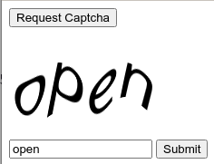

# zcaptcha
A collection of a few small javascript captchas for rplace.tk

Requirements:
- Latest version of Node.js
- websocket node module (provided in repo)
- imagemagick node module (provided in repo)
- a functioning web browser to test the demo (index.html + node server.js)
- ImageMagick and Pango (not tested)

